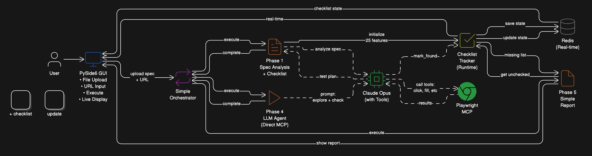
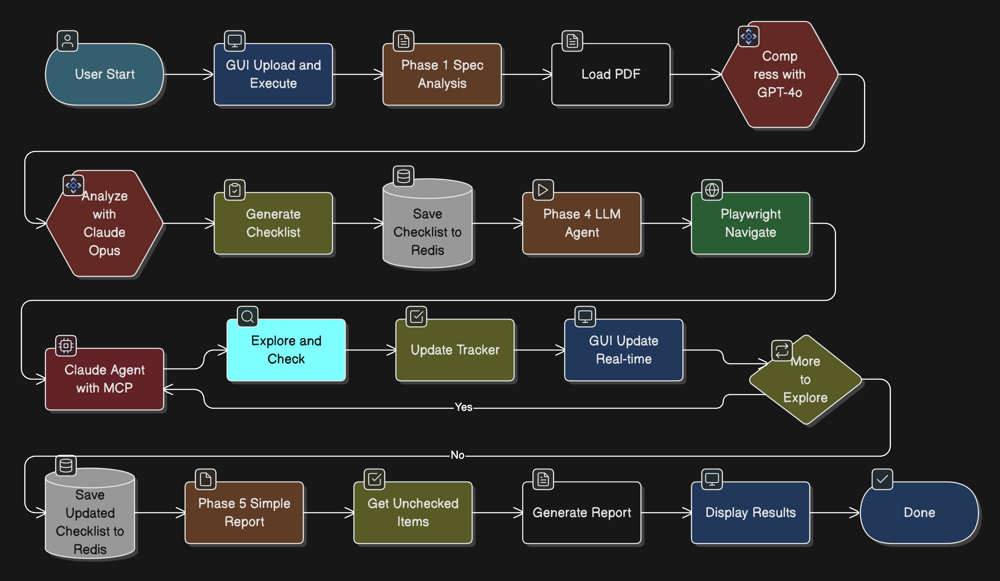
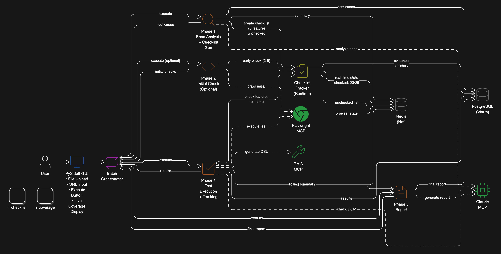
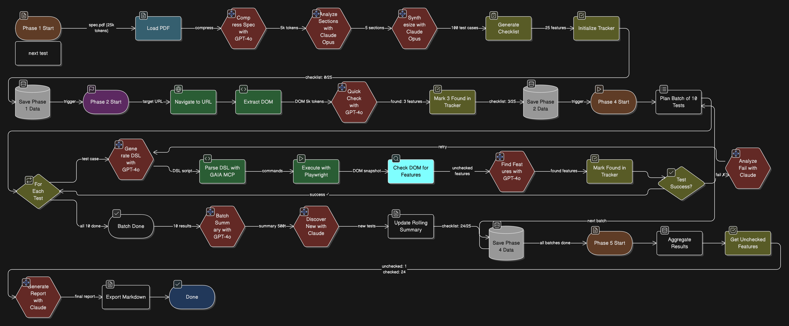

# 📑 회의록 (2025-10-14)

**주제:** GAIA 정량지표(KPI) 1차 설정 및 아키텍처·플로우 설계 검토  

### 참석자
- 장진형  
- 박기주  
- 변영승  
- 심창완  

---

### 주요 회의 내용

---

### 1. 정량지표(KPI) 1차 설정  
- 프로젝트 성능 측정을 위한 **핵심 정량지표 2가지**를 1차적으로 설정함  
- 아직 최종 확정된 것은 아니며, **향후 기능 구현 및 테스트 결과에 따라 조정 가능성 있음**

---

#### ✅ ECR — Site Element & Function Coverage Rate (요소·기능 커버리지 비율)
- **목적:**  
  타겟 사이트의 전체 상호작용 요소 및 기능 대비, 실제 테스트 플랜이 존재하고 실행된 항목 비율을 수치화  
- **측정 방법:**  
  - 분모(고정): 요소 59 + 기능 105 = 총 164 항목  
  - 분자: 실행 로그에서 실제 수행된 항목 수 (pass/fail 무관)  
  - 기준:  
    - 요소 기준: 해당 `element_id` 대상 최소 1회 액션 존재  
    - 기능 기준: 해당 `function_id` 대상 1회 이상 체크 또는 시나리오 수행  
  - 계산식:  
    - `ECR_overall = (tested_elements + tested_functions) / 164 × 100`  
    - `ECR_elem = tested_elements / 59 × 100`  
    - `ECR_func = tested_functions / 105 × 100`  
- **목표치:**  
  - 합격선: `ECR_overall ≥ 70%` (≥ 115/164 항목 실행)  
  - 스트레치 목표: `ECR_overall ≥ 80%` (≥ 132/164 항목 실행)  
  - 반복 조건: 데모 반복 실행의 **90% 이상**이 위 조건 충족 시 최종 합격

---

#### ✅ ER — Error Rate (Composite) (오류율: 미탐지 버그 + 설계 실패)
- **목적:**  
  버그 탐지 품질(시드 버그를 놓치지 않는가)과 테스트 설계 품질(정상 케이스를 불필요하게 실패시키지 않는가)을 종합적으로 측정  
- **측정 방법:**  
  - 분해 지표:  
    - `MBR = missed_seeded / total_seeded` (미탐지 비율)  
    - `TQF = bad_test_fails / should_pass` (설계 실패 비율)  
  - 최종 계산식:  
    - `ER = (missed_seeded + bad_test_fails) / (total_seeded + should_pass) × 100`  
  - 정의:  
    - **미탐지:** 런 종료 시 `bug_id`의 탐지 이벤트 또는 원인 코드 없음  
    - **설계 실패:** 오라클 기준 ‘정상 동작’이어야 하는 케이스가 실패한 경우  
  - 데이터 출처: 시드 버그 테이블(고정), 실행 로그, `audit.jsonl`  
- **목표치:**  
  - 합격선: `ER ≤ 20%`  
  - 권장 조건: `MBR ≤ 20%`, `TQF ≤ 10%`  
  - 반복 조건: 데모 반복 실행의 **90% 이상**이 위 조건 충족 시 최종 합격

📌 **비고:** 현재 지표는 1차 설정 단계이며, MVP 성능 결과 및 향후 테스트 데이터에 따라 변경될 수 있음.

---

### 2. 아키텍처 및 플로우 설계 검토  
- GAIA 프로젝트의 전체 아키텍처를 다시 점검하고, 테스트케이스 생성 → 실행 → 결과 분석 → 리포트 생성까지의 전체 흐름을 정리  
- 각 단계(Phase 1~5: 사양 분석 → 초기 점검 → 실행 → 추적 → 리포트)별 기능 정의 및 모듈 간 연결 구조를 명확히 함  
- Redis(Hot) / PostgreSQL(Warm) 기반의 상태 저장 및 이력 관리 구조를 확립하고, 데이터 흐름 설계를 완료함

---

### 1학기 목표 아키텍처와 플로우

---

### 최종 아키텍쳐와 플로우

---

### ✅ 결론 (2025-10-14)  
- 프로젝트 성능 평가용 **정량지표 2가지(ECR, ER)** 1차 설정 완료 *(향후 조정 가능)*  
- 전체 시스템 **아키텍처 및 플로우 설계** 완료 및 데이터 흐름 구조 확립  
- **1학기 목표 아키텍쳐 및 플로우**, **최종 목표 아키텍쳐 및 플로우** 설계 

---

📌 **요약:** 이번 회의에서는 GAIA 프로젝트의 성능 평가를 위한 정량지표를 1차적으로 설정하고, 전체 구조 및 플로우를 확정하였다. 해당 지표는 MVP 이후 테스트 결과에 따라 최종적으로 조정될 예정이다.
